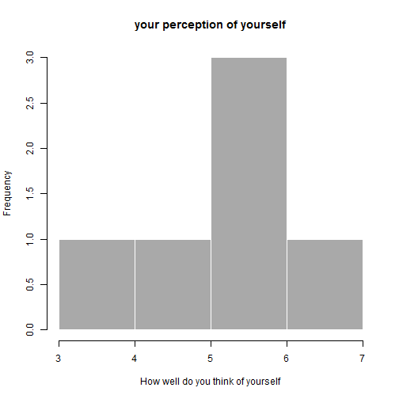

## Phsycological prediction

1. Goal:


  * Make a simple shiny app that predict wether or not you're doing great in your life 
  * Based on 6 question on your daily life

2. The output 
  
  * Chart showing the distribution of the answers
  * Reccomandations based on the answer. 

--- .class #id 

## Introduction

* Based on the data provided by the user R run quite a lot _if-else_ statement and then gives you the  text     output
* the overall process works like this:
1. You answer the question

 * How well would you describe yourself in terms of job success, on a scale 1-7?
 
 * How many times per week do you see your girlfriend/boyfriend/wife/husband in a week and speak truly, on a         scale 1-7?
  * How often per week you managed to see your friends, on a scale 1-7?
 
  * How many times per week do you train in the gym or make sports outside, on a scale 1-7?
  
  * how many times per week do you drink less than two beer/any other alcohol, on a scale 1-7?
  
  * how many times per week do you consider what you are doing as helpful to someone, on a scale 1-7?

```

--- .class #id 


## Example

* Then based on the answers, (_input_ here in the code chunks is an array of possible answers) it gives you an advice on your life.


```r
input<-as.data.frame(c(3,6,5,6,7,6))
rownames(input)<-c("id1","id2","id3","id4","id5","id6")
input<-as.data.frame(t(input))
if (input$id1<3.5&input$id2<3.5&input$id3<3.5&input$id4<3.5&input$id6<3.5){
        "You're one of those who underestimate themself. My personal advice
        is that you start believe in yourself and give to your life a pathway  "
      } else {
        "overall you're doing fine but remember trying to be great in something you do."
      }
```

```
## [1] "overall you're doing fine but remember trying to be great in something you do."
```

as you can see the final reccomendation is simple and neat.

--- .class #id 

## Charts and future development

* There is also a chart showing the distribution of your answers

 

--- .class #id 

## Conclusion

* The code chunks in these slides is only a small part of the real algorithm, that due to its length, I wasn't able to provide it complete.
* In the future the code would be comprehensive of all the possible answers and combination of them, which are  possible_reccomendations =823543!!

